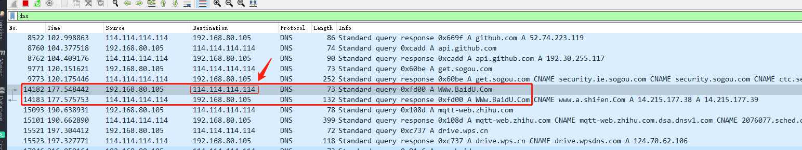
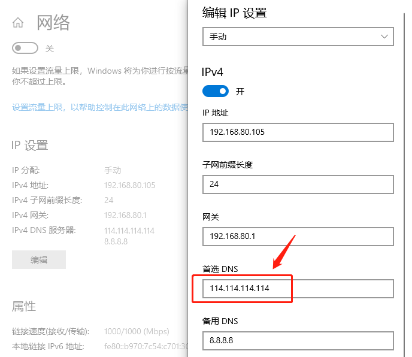
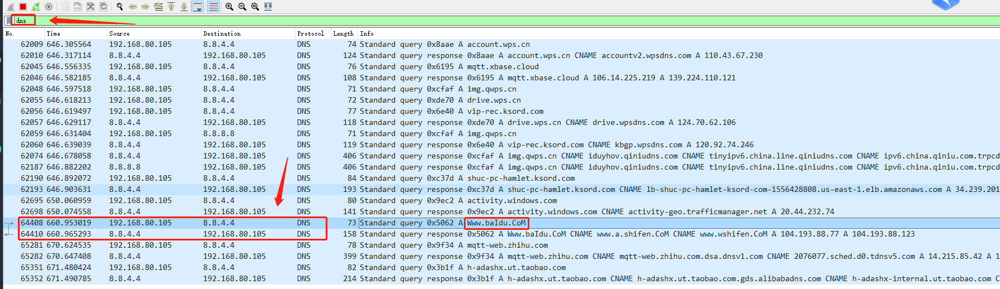

## 基于JNA调用实现DNS域名异步解析
### 1. before
虽然JNI也可以完成Java与c/c++的互通，但是在返回特定数据时会异常异常麻烦，甚至连回调代码都需要自己写，弄了许久回调成功了，但是一调试就崩溃。如返回一个 Map<Integer,List<String>> 则需要先构建一个各种数据类型，操作如下：
``` c++
jobject buildHashMap(JNIEnv* env, map<int, vector<string>> mapper) {
	jclass class_hashmap = env->FindClass("java/util/HashMap");
	jmethodID hashmap_construct_method = env->GetMethodID(class_hashmap, "<init>", "()V");
	printf("get hashmap_construct_method success \n");
	jobject obj_hashmap = env->NewObject(class_hashmap, hashmap_construct_method);
	jmethodID hashmap_put_method = env->GetMethodID(class_hashmap, "put", "(Ljava/lang/Object;Ljava/lang/Object;)Ljava/lang/Object;");
	printf("get hashmap_put_method success \n");
	map<int, vector<string>>::iterator iter;
	for (iter = mapper.begin(); iter != mapper.end(); iter++)
	{
		vector<string>& ips = iter->second;
		if (ips.size() == 0) {
			continue;
		}
		// new一个ArrayList对象
		jclass class_arraylist = env->FindClass("java/util/ArrayList");
		jmethodID arraylist_construct_method = env->GetMethodID(class_arraylist, "<init>", "()V");
		jobject obj_arraylist = env->NewObject(class_arraylist, arraylist_construct_method, "");
		jmethodID arraylist_add_method = env->GetMethodID(class_arraylist, "add", "(Ljava/lang/Object;)Z");
		printf("get arraylist_add_method success \n");
		for (auto item : ips)
		{
			env->CallBooleanMethod(obj_arraylist, arraylist_add_method, item);
		}

		env->CallObjectMethod(obj_hashmap, hashmap_put_method, iter->first, obj_arraylist);
	}
	return obj_hashmap;
}
```
几乎每种类型都需要先找到对应的Java类型，然后再找到构造函数，最后NewObject，异常麻烦。有了JNA就省去了该部分代码，可以在Java端使用 xxxxByReference 
来完成复杂数据类型的取值操作。

### 2. 重点 - 完成DNS异步解析功能
为什么需要用到DNS异步解析功能，这个起源于项目中使用到rocketmq-4.8.0时发现，当我们在配置文件中的brokerIP1设置的是域名时，会导致某条消息已消费但是实际上控制台的状态却消失未未消费。
最后查看源码发现是因为rocketmq没有对该属性进行域名解析，导致判断出错。后来我就在github提了一个 [issue](https://github.com/apache/rocketmq/issues/2697) ，后来发现竟然还可以使用异步的方式来解析域名，
所以才找到了三方高性能网络库 libevent 来解析。该库基于C语言开发，故需要用到 JNA .


### 3. 遇到的问题及遗留问题

最蛋疼的莫过于从C++传一个字符数组回到 Java，对应关系是 char** -> String[ ]。Java 端使用的是 PointerByReference 指针引用，该类型的部分操作实在有点让人抓狂，stackoverflow也有人在为此吐槽。搞许久才算有结果，然鹅，然鹅... 不知道为什么C++实际解析是两个不同的IP，到了Java缺是两个一样的IP，指针都一样，头大。阿姨，我不想努力了！！！遗留问题后面有时间再处理。

``` sh
errcode: 0    // java 打印
14.215.177.38 // java 打印
14.215.177.38 // java 打印
www.baidu.com: 14.215.177.39 , index: 0, result[i]: 14.215.177.39  // C++ 打印
www.baidu.com: 14.215.177.38 , index: 1, result[i]: 14.215.177.38  // C++ 打印
```

经过一番挣扎，Java返回不同元素返回同样指针的问题其实可以理解为Java中的深浅拷贝问题，但是放到C++就有点抓不着头脑。最后还是在C++中把转换出来的IP再做一次拷贝后放到数组即可。

### 4. 使用 netty 做域名解析

2021.5.12上班时在B站不经意间看了下netty最新版本，发现它里面原本就有域名解析的相关类，于是上[GitHub](https://github.com/netty/netty/blob/4.1/example/src/main/java/io/netty/example/dns/tcp/TcpDnsClient.java) 看了下里面的 example， 有 TcpDnsClient，DnsClient，同样是以异步的方式进行解析。后来想了想前面使用libevent真是绕了太大的弯，不过多少也明白使用jna开发可以比jni更加高效。其实还有个问题，就是在c++代码解析域名中我并没有指定域名服务器，而netty 的demo里面是需要指定的，那libevent默认是使用什么DNS服务器呢？于是找到wireshark试试，发现其实是使用windows系统默认的首选DNS服务器，只要把这个选项一修改就会发现请求的地址也变了。








正在我拉取rocketmq源码使用最新版本netty的Dns域名解析代码修复bug准备提交pr时又发现了新问题，rocketmq-4.8.0 使用的是 netty-4.0.42.Final，而netty-4.1.x才有Dns相关模块，凉凉... 解决办法要么直接使用新版netty，要么还是使用三方类库如libevent对接。

#### 4.1 直接升级netty到新版

初步尝试修改了netty版本到 4.1.62.Final, 编译后就发现又不少类类做了升级，改动还是比较大。如broker模块需要调整 FileRegion 实现，remoting模块需要调整 NettyBridgeLogger实现等，所以决定还是先放弃了，等官方决定吧。

#### 4.2 使用 libevent 完成域名解析

目前已经在windows系统完成C++与Java互通，小问题就是返回的域名数组有问题。接下来就是在Linux系统完成C++与Java互通，最后再将DLL与so文件放到Java项目的资源文件完成跨平台。其实还差参数配置需要完善。还有更重要的问题是自身对C++不熟悉，自身写的代码很可能存在内存没有释放的问题。